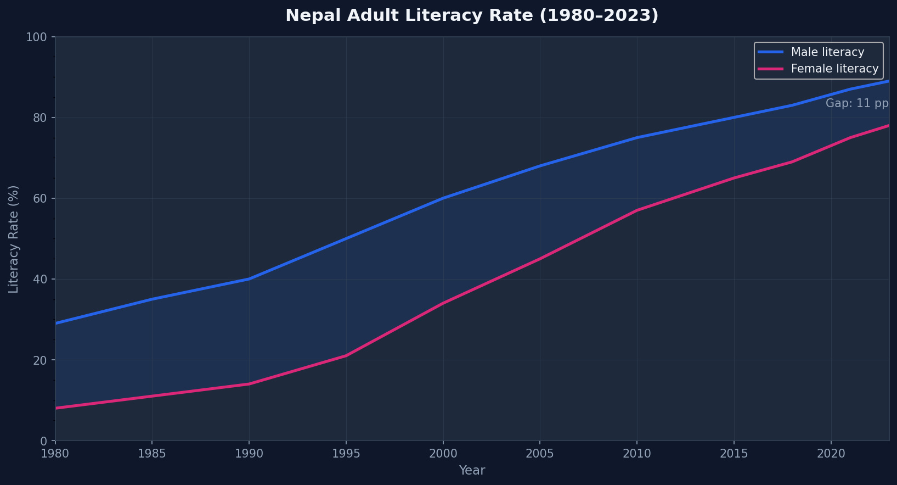

# 📚 Nepal Education & Literacy Trends (1980–2023)

> Exploring 40+ years of Nepal's education development using World Bank open data.

---

## 📌 Overview

Nepal has undergone dramatic shifts in literacy and school enrollment since the
1980s — but the story looks very different when broken down by gender, region,
and time. This project visualizes those trends using publicly available
World Bank data and Python.

**Key questions explored:**
- How has Nepal's literacy rate evolved across genders?
- What's the trend in primary vs. secondary school enrollment?
- How does Nepal compare to regional South Asian neighbors?

---

## 📊 Visualizations

| Chart | Description |
|-------|-------------|
| Literacy Rate Over Time | Male vs Female literacy (1980–2023) |
| School Enrollment Trends | Primary & secondary net enrollment rates |
| Gender Parity Index | Closing the gap — how fast? |
| South Asia Comparison | Nepal vs India, Bangladesh, Sri Lanka |

*(Charts generated in `outputs/` folder)*

---

## 🛠️ Tech Stack

- **Python 3.12**
- **pandas** — data loading, cleaning, reshaping
- **NumPy** — numerical operations
- **Matplotlib** — all visualizations
- **Jupyter Notebook** — exploratory analysis

---

## 🚀 Getting Started

### 1. Clone the repo
```bash
git clone https://github.com/sushanttds-jpg/nepal-education-explorer.git
cd nepal-education-explorer
```

### 2. Install dependencies
```bash
pip install -r requirements.txt
```

### 3. Run the visualizer
```bash
python src/visualize.py
```
Charts will be saved to `outputs/`.

---

## 📂 Data Source

World Bank Open Data — [Education Statistics](https://data.worldbank.org/topic/education)

Indicators used:
- `SE.ADT.LITR.ZS` — Adult literacy rate (%)
- `SE.PRM.ENRR` — Primary school enrollment (net %)
- `SE.SEC.ENRR` — Secondary school enrollment (net %)
- `SE.ENR.PRSC.FM.ZS` — Gender Parity Index

---

## 📈 Sample Output



---

## 🔭 Future Work

- [ ] Add district-level data from CBS Nepal
- [ ] ML forecasting: literacy rate projection to 2030
- [ ] Interactive dashboard using Plotly
- [ ] Integrate with SDG Goal 4 benchmarks

---

## 👤 Author

**Sushant** — BDS Student, Tribhuvan University  
[GitHub](https://github.com/sushanttds-jpg) · [LinkedIn](https://www.linkedin.com/in/sushant-thapa-ba290838b/)

---

